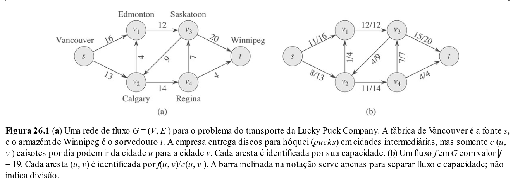
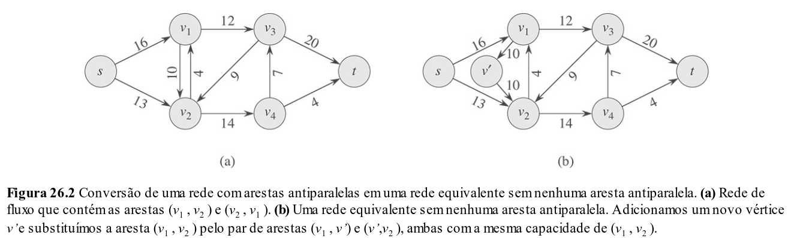
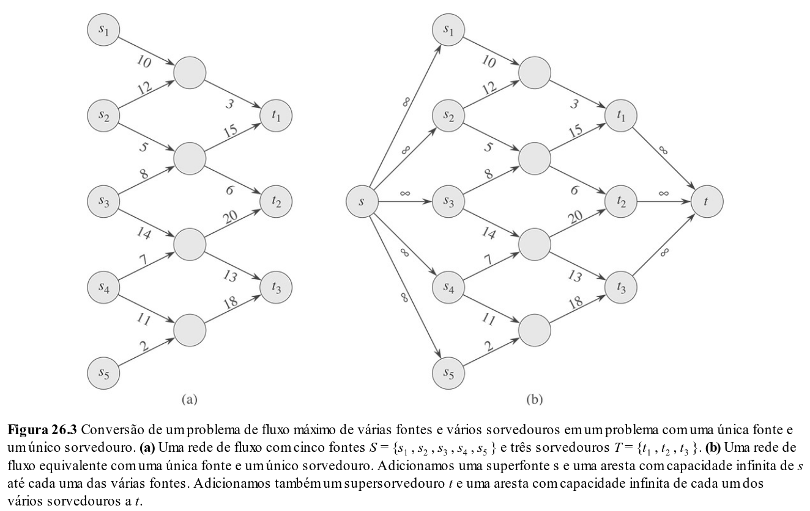
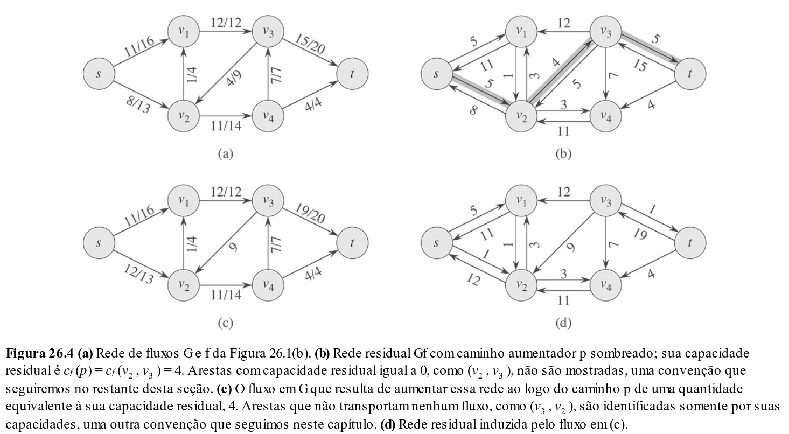

# Fluxo Máximo

## 26.0

### Conceitos

- Fonte
- Sorvedouro
- Fluxo: taxa
- Aresta: conduto
- capacidade: taxa máxima permitida
    - 200 L de líquido por hora por um cano
    - 20 ampéres de corrente elétrica por um fio condutor
- Vértice: junção de condutos
- Conservação de fluxo: $\forall$ vértice: taxa de entrada = taxa de saída. 
    - equivalente à lei das correntes de Kirchhoff

### O Problema

- **Descrição**: desejamos encontrar a maior taxa pela qual podemos despachar material da fonte até o sorvedouro, sem infringir quaisquer restrições à capacidade.
- Pode ser resolvido por algoritmos eficientes.

### Mecanismo

- fonte produz material m a uma taxa t
- sorvedouro consome m a uma taxa t
- Seja V um vértice:
    - **Conservação de fluxo**: taxa de entrada em V = taxa de saída em V.

### Métodos gerais

- Ford-Fulkerson
- Push-Relabel: base para a maioria dos algoritmos mais rápidos
    - relabel-to-front: implementação do método push-relabel.
        - complexidade de tempo: $O(V_3)$
        - não é o mais rápido, é razoavelmente eficiente, ilustra técnicas dos algoritmos mais eficientes.

### Aplicações

- fluxo de materiais
    - líquidos por tubos
    - peças em linhas de montagem
    - correntes por redes elétricas
    - informações por redes de comunicação

## 26.1 Redes de Fluxo

### Mais formalmente...

- rede de fluxo: $G = (V, E)$, onde $G$ é um grafo dirigido.
- capacidade $c$: $\forall (u, v) \in E$, $c(u, v) \geq 0$.
- $\exists (u, v) \in E \implies \nexists (v, u) \in E$. 
- $(u, v) \notin E \implies c(u, v) = 0$. Por conveniência.
- $\nexists (u, u) \in E$. Não existem laços.
- fonte $s$.
- sorvedouro $t$.
- Seja $v \in V$, tal que $v \neq s$ e $ v \neq t$:
    - $\forall v$ existe um caminho entre $s$ e $t$ que passa por $v$.
        - Logo, $G$ é conexo.
- Todo vértice, exceto $s$, possui ao menos uma aresta de entrada.
    - $|E| \geq |V| - 1$
- fluxo: $f : V \times V \to R$:
    - Restrição de capacidade: $\forall u, v \in V, 0 \leq f(u, v) \leq c(u, v)$.
    - Conservação de fluxo: $\forall u \in V - \{s, t\}, \sum\limits_{v \in V} f(v, u) = \sum\limits_{v \in V} f(u, v)$.
    - $\nexists (u, v) \in E \implies f(u, v) = 0$.
    - $f(u, v)$ lê-se: fluxo do vértice $u$ ao vértice $v$.
- **valor** $|f|$ de um fluxo: $|f| = \sum\limits_{v \in V} f(s, v) - \sum\limits_{v \in V} f(v, s)$.
    - Isto é, fluxo que sai da fonte menos o fluxo que entra na fonte.
        - Note: normalmente não existe aresta de entrada na fonte $s$ e portanto $\sum\limits_{v \in V} = 0$. No entanto será útil quando apresentarmos **redes residuais**. 

- **Problema do fluxo máximo**: dado uma **rede de fluxo** $G$, com **fonte** $s$ e **sorvedouro** $t$, devemos encontrar um **fluxo** de **valor** máximo.

Exemplo:

Note: no grafo **(b)**, $|f|$ é dado por $f(s, v_1) + f(s, v_2) = 11 + 8 = 19$.

### Modelando problemas com arestas antiparalelas.

Para cada par de arestas antiparalelas, escolhemos uma delas, substituímos-la por duas novas arestas e um vértice, tal que essa duas novas arestas tenham, cada uma separadamente, a mesma capacidade que a aresta original.

***Exercício 26.1-1***: *prove que a rede resultante é equivalente à original.*

### Redes com várias fontes e vários sorvedouros.

1. Adicione uma superfonte $s$.
2. Para cada $s_i$, adicione uma aresta orientada $(s, s_i)$ com capacidade $c(s, s_i) = \infty$.
3. Adicione um supersorvedouro $t$.
4. Para cada $t_i$, adicione uma aressta orientada $(t_i, s)$ com capacidade $c(t_i, t) = \infty$.

Intuitivamente, $s$ fornece o fluxo desejado para cada $s_i$ e $t$ consome o fluxo desejado por cada $t_i$.

***Execício 26.1-2***: *prove formalmente que os dois problemas são equivalentes.*

## 26.2 O Método Ford-Fulkerson

- Método e não algoritmo
- aumenta iterativamente o valor do fluxo.
    - começamos com $f(u, v) = 0$, $\forall u, v \in V$.

$f \leftarrow 0$ 
enquanto ($\exists$ caminho aumentante $p$ na rede residual $G_f$): 
&emsp;aumentar fluxo $f$ ao longo de $p$. 
return $f$

### Conceitos importantes

- redes residuais
- caminhos aumentadores
- cortes
- Teorema do fluxo máximo/corte mínimo: caracteriza o valor de um fluxo máximo em termos de cortes da rede de fluxo.

### Redes residuais

- $G_f$ denota um ***rede residual***, onde $G$ é uma *rede de fluxos* e $f$ um *fluxo*.

- $c_f(u, v)$ denota a ***capacidade residual***, i.e., a quantidade de fluxo que a aresta $(u, v)$ ainda pode receber. Note que $c_f(u, v) = c(u, v) - f(u, v)$.

- $(u, v) \in G_f \implies c_f(u, v) > 0$.

- $c(u, v) = f(u, v) \implies (u, v) \notin G_f$. 

- $(u, v) \in G_f \not\implies (u, v) \in G$. Isto é, é possível que existam arestas em $G_f$ que não estejam em $G$.

    - Em outras palavras: $\Diamond (\exists (u, v) \in G_f : (u, v) \notin G)$. 

    - Ou ainda mais especificamente: $(u, v) \in G \implies \Diamond (\exists (v, u) \in G_f)$. Isto é, dado uma aresta $(u, v)$ de G, é possível que a sua antiparalela $(v, u)$ esteja em $G_f$.  

        - $(v, u)$ tem *capacidade residual* $c_f(v, u) = f(u, v)$, isto é, ela pode "devolver" o fluxo $f(u, v)$.

- Definição geral de **capacidade residual**:
$$
c_f(u, v) = 
\begin{cases}
c(u, v) - f(u, v) & \text{se } (u, v) \in E, \\ 
f(u, v) & \text{se } (v, u) \notin E, \\
0 & \text{caso contrário.} \\
\end{cases}
$$

- Exemplo: 
    - suponhamos que para uma determinada aresta $(u, v)$ vale que:
        - $c(u, v) = 16$ ("suporta até 16L de água") 
        - $f(u, v) = 11$ ("atualmente tem 11L de água passando, dos 16L suportados")
    - podemos então deduzir que:
        - podemos aumentar $f(u, v)$ em até $5$ unidades. (assim, $c_f(u, v) = 5 = 16 - 11 = c(u, v) - f(u, v)$).
        - além disso, o algoritmo poderá retornar a água que está passando, ou seja, $c_f(v, u) = 11 = f(u, v)$.

- Seja $G = (V, E)$ uma rede de fluxo e $f$ um fluxo, a **rede residual** de $G$ induzida por $f$ é $G_f = (V, E_f)$, onde $E_f = \{(u, v) \in V \times V : c_f(u, v) > 0\}$.

- As arestas em $E_f$ são $(u, v) \in E$ ou suas inversas $(v, u) \notin E$. Assim, $|E_F| \leq 2|E|$. 

- um fluxo em uma *rede residual* serve como guia para adicionar fluxo à rede original.

- $f \uparrow f'$ denota o aumento do fluxo $f$ de $f'$:

$$
(f \uparrow f')(u, v) = 
\begin{cases}
f(u, v) + f'(u, v) - f'(v, u) & \text{se } (u, v) \in E,\\
0 & \text{caso constrário.}\\
\end{cases}
$$

- onde: 
    - $f(u, v)$ é o fluxo atual.
    - $f'(u, v)$ é o fluxo que ainda pode ser adicionado na aresta sem que a capacidade se exceda.
    - $f'(v, u)$ é o fluxo que está sendo mandado de volta.

- substrair $f'(v, u)$ é uma operação conhecida como ***cancelamento***.

**Lema 26.1**: Seja $G = (V, E)$ uma rede de fluxo com fonte $s$ e sorvedouro $t$, e seja $f$ um fluxo em $G$. Além disso, seja $G_f$ a rede residual de G induzida por $f$ e seja $f'$ um fluxo em $G_f$. Vale que $f \uparrow f'$ é um fluxo em $G$ com valor $|f \uparrow f'| = |f| + |f'|$. 

### Caminhos aumentadores

- Um **caminho aumentador** $p$ é um caminho simples de $s$ a $t$ na rede residual $G_f$.
- A **capacidade residual de um caminho** $p$ é $c_f(p) = min\{c_f(u, v) : (u, v) \text{ está em p}\}$.
    - $c_f(p)$ é a menor das capacidade residuais dentre todas as arestas de $p$.

**Lema 26.2**: Seja $G = (V, E)$ uma rede de fluxo, seja $f$ um fluxo em $G$ e seja $p$ um caminho aumentador em $G_f$. Defina uma função $f_p(u, v) = \begin{cases} c_f(p) & \text{se } (u, v) está em p,\\0 & \text{caso contrário.}\\ \end{cases}$. Então, $f_p$ é um fluxo em $G_f$ com valor $|f_p| = c_f(p) > 0$.

**Corolário 26.3**: seja $G = (V, E)$ uma rede de fluxo, seja $f$ um fluxo em $G$ e seja $p$ um caminho aumentador em $G_f$. Suponha que aumentamos $f$ adicionando $f_p$. Então, a função $f \uparrow f_p$ é um fluxo em $G$ com valor $|f \uparrow f_p| = |f| + |f_p| > |f|$.

### Cortes de redes de fluxo

- Como saber que encontramos um fluxo máximo?
    - Teorema do fluxo máximo/corte mínimo!

- Um **corte** $(S, T)$ de uma rede de fluxo $G = (V, E)$ é uma partição de $V$ em $S$ e $T = V - S$ tal que $s \in S$ e $t \in T$.
    - **fluxo líquido** que passa pelo corte: $f(S, T) = \sum\limits_{u \in S} \sum\limits_{v \in T} f(u, v) - \sum\limits_{u \in S} \sum\limits_{v \in T} f(v, u)$ 
    - **capacidade** do corte $(S, T)$: $c(S, T) = \sum\limits_{u \in S} \sum\limits_{v \in T} c(u, v)$.

## Referência bibliográfica

(livro texto) Cormen, T.H.; Leiserson, C.E.; Rivest, R.L.; Stein C..; Algoritmos. Tradução da 3ª edição americana Teoria e Prática.
